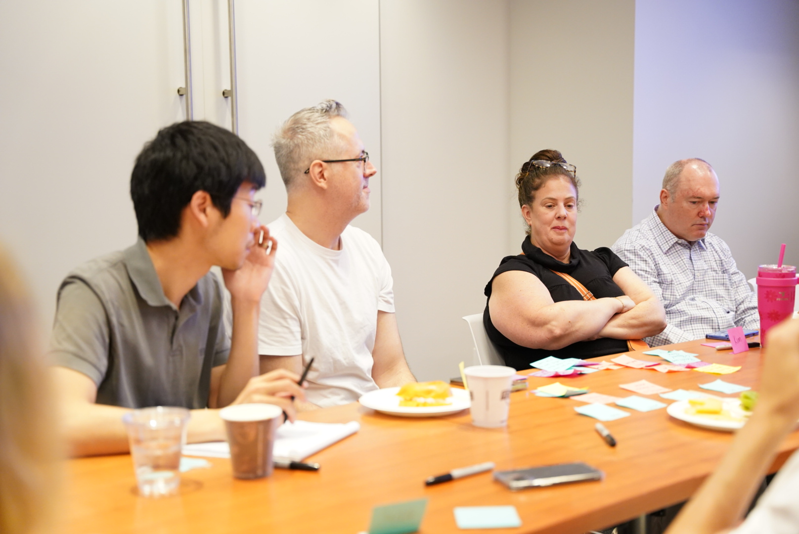
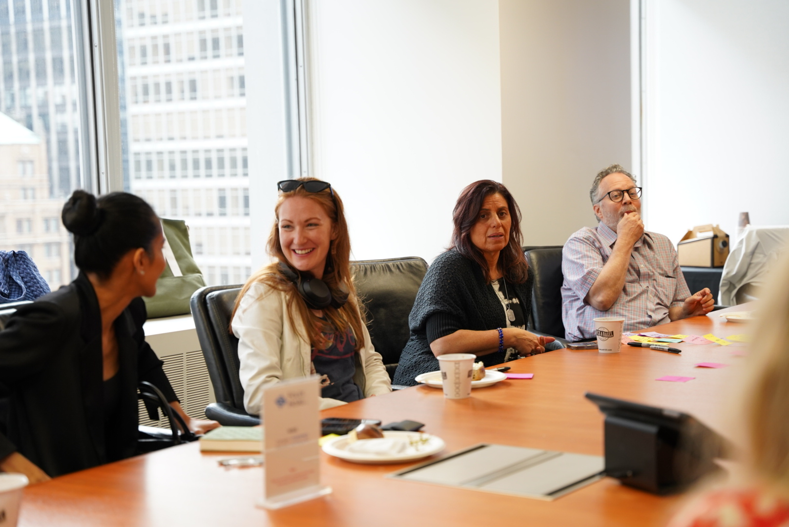
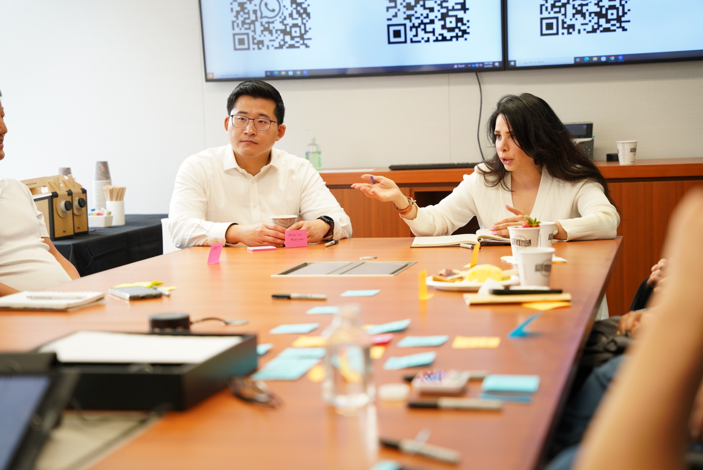
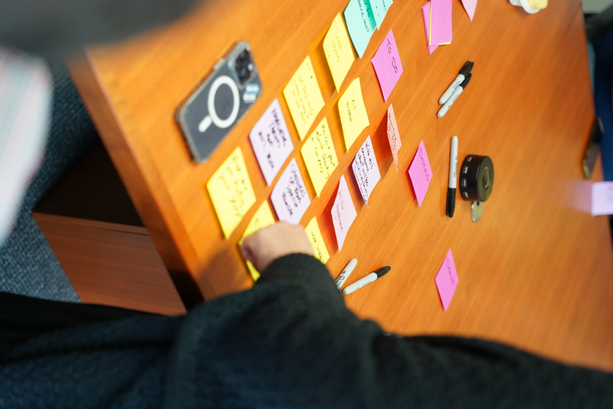
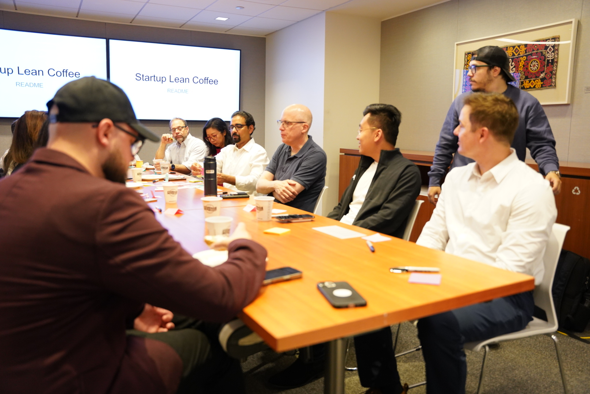
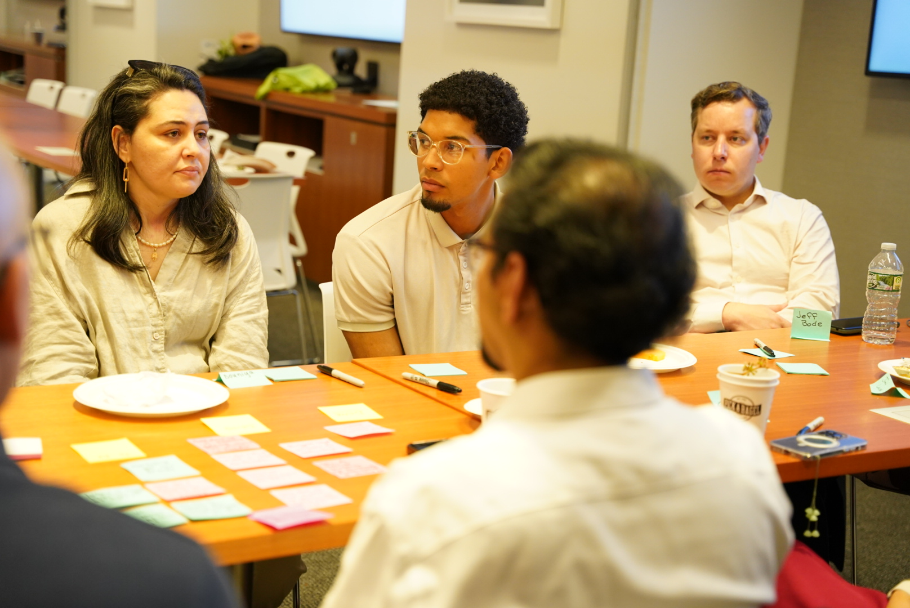
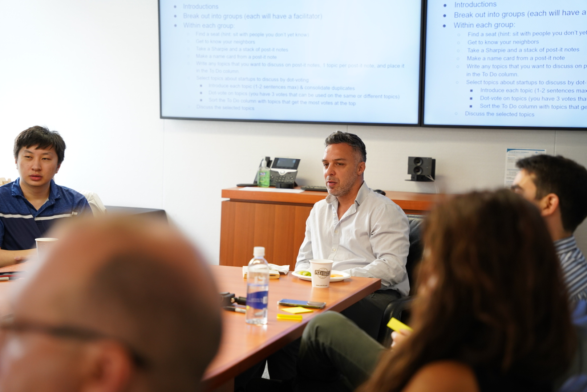

# Table site — proposed image selections

> Scrollable image-first version. Each proposed pairing shows the image, the slot it fills, and a one-line rationale. Approve all, or call out swaps.
>
> **Sources:** November 2025 folder (28 files, current era) + June 2025 folder (32 files, pre-rebrand). 65 candidates total in `assets/images/incoming/` (gitignored). Approved subset gets renamed and moved into `assets/images/` for the build.

---

## HOME PAGE

### Hero — full-width attendees behind tagline overlay


**`DSC01100.JPG`** — Wide shot down the table. ~8 diverse attendees, post-its everywhere, projector screen visible. Strong horizontal composition with the table receding in perspective; works for a hero band with text overlay on the left.

---

### Real rooms.


**`DSC01093.JPG`** — Three organizers standing at the front of the room, audience visible in foreground, NYC skyline through the window. Establishes "in person, around a real table" with a sense of place.

---

### Real questions.


**`DSC01102.JPG`** — Five attendees lined up at a long table; foreground attendee speaking with a pen in hand. Post-its and coffee cups everywhere. Captures the "every attendee proposes the topics" energy.

---

### Real talk.


**`DSC01117.JPG`** — Two attendees in intimate conversation. Sticky notes cover the table foreground in saturated color. No organizers in frame — pure peer-to-peer moment.

---

### Members band — 6 thumbnails

A small grid under "Who's at Table — 1,300+". Picking 6 with visual variety so the grid feels like a collage of moments, not a stock-portrait lineup.

#### Members 1


**`DSC01118.JPG`** — 4 attendees side-by-side listening; post-its on table.

#### Members 2


**`DSC01110.JPG`** — Four attendees in conversation; candid attentive faces, post-its prominent on the table.

#### Members 3



**`DSC08398.JPG`** — 4 attendees listening; mixed expressions, daylight.

#### Members 4



**`DSC08393.JPG`** — 4 attendees with NYC view; warm smile in center.

#### Members 5



**`DSC08377.JPG`** — Woman gesturing mid-sentence to attentive listener.

#### Members 6


**`DSC01103.JPG`** — Five attendees at the long table; foreground attendee speaking with hands raised mid-thought, the rest leaning in. Strong table-side angle, post-its everywhere — different perspective from the other five.

---

### Aha moments — optional section banner



**`DSC08339.JPG`** — Overhead shot of saturated post-its on wood, with a Sharpie and a reaching hand. Pure brand-cue image. The aha-moments section is otherwise CSS-rendered post-its (no photo required); this could anchor the section header above the synthetic post-its below, or hold for future use.

---

## ABOUT PAGE

### Three-organizer photo


**`DSC01076.JPG`** — Geoff, Karina, Benjamin posed together. Same photo (or near-identical) used in the prior Squarespace site. File has portrait EXIF orientation — handled in CSS with `image-orientation: from-image` or by re-saving landscape.

---

### Origin 4a — "In 2018, Geoff Scott started something simple..."



**`DSC08322.JPG`** — Wide-angle establishing shot with "Startup Lean Coffee README" visible on the screen. Historical authenticity for the 2018-era paragraph.

---

### Origin 4b — "No keynote speakers. No pitch decks. Just genuine, raw conversations..."



**`DSC08363.JPG`** — Three attendees listening intently; intimate framing; post-its and name cards on the table. Visual analog for "things that actually keep them up at night."

---

### Origin 4c — "The conversations have spanned fundraising, product-market fit, AI..."



**`DSC08410.JPG`** — Speaker mid-thought with Lean Coffee instructions visible on slides behind. Pairs with the paragraph about diverse topics; shows the format that produced those conversations.

---

### Origin 4d — "In 2025, Benjamin Friedman and Karina Muller joined as co-organizers..."


**`DSC01084.JPG`** — Karina and Benjamin in casual standing conversation. Quiet, behind-the-scenes feel that matches the paragraph naming them as co-organizers.

---

### Origin 4e — "Today, Table runs regular gatherings in New York and beyond..."


**`DSC01122.JPG`** — Group around the table with thumbs-up, candid energy, post-its everywhere. Celebratory closer for "There's always a seat for you at Table."

---

## SPONSORS PAGE

No images proposed for v1 — the page is mostly typographic (hero + 3 short blocks + 3 sponsor logo cards + contact). Adding photography would compete with the logos. If we want one atmospheric shot for the hero band, easiest pull would be `DSC01100.JPG` (same as home hero) reused at smaller scale, or none at all.

---

## File rename plan

When approved, the 16 chosen files (+1 optional banner) move into `assets/images/` with descriptive names:

```
DSC01100.JPG → hero-table-wide.jpg
DSC01093.JPG → real-rooms-organizers-audience.jpg
DSC01102.JPG → real-questions-attendee-speaking.jpg
DSC01117.JPG → real-talk-pair-conversation.jpg
DSC01118.JPG → members-01-row-listening.jpg
DSC01110.JPG → members-02-karina-attendees.jpg
DSC08398.JPG → members-03-row-daylight.jpg
DSC08393.JPG → members-04-nyc-window.jpg
DSC08377.JPG → members-05-conversation.jpg
DSC01103.JPG → members-06-speaking-tableside.jpg
DSC08339.JPG → aha-moments-postits-overhead.jpg   (optional)
DSC01076.JPG → organizers-three.jpg
DSC08322.JPG → origin-2018-lean-coffee.jpg
DSC08363.JPG → origin-raw-conversations.jpg
DSC08410.JPG → origin-format-speaker.jpg
DSC01084.JPG → origin-coorganizers-2025.jpg
DSC01122.JPG → origin-today-group.jpg
```

`incoming/` stays gitignored; the 49 unused files don't ship.

---

## Open questions

1. **Hero pick** — `DSC01100` is the strongest wide shot I saw. If you prefer the higher-energy thumbs-up `DSC01122` instead, easy swap (move 1122 → hero, find a different origin-today closer).
2. **Sponsors hero** — none, or reuse `DSC01100` smaller? Recommendation: none.
3. **Aha moments banner** — yes or no on using `DSC08339`?
4. **More candidates** — I sampled ~28% of the library. If specific shots you have in mind aren't here, give me the file numbers and I'll pull them.
