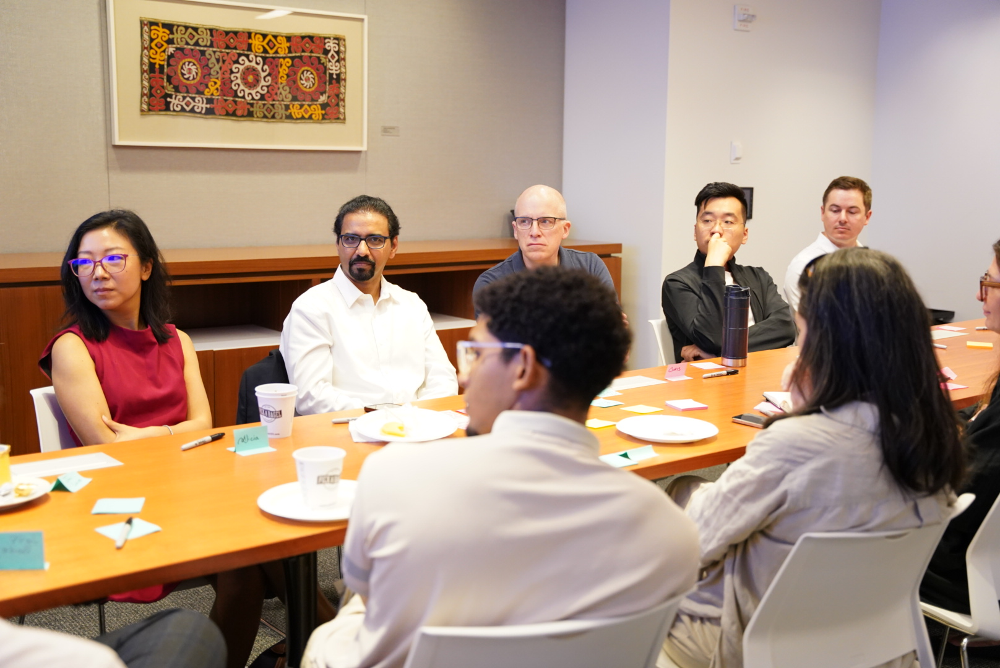
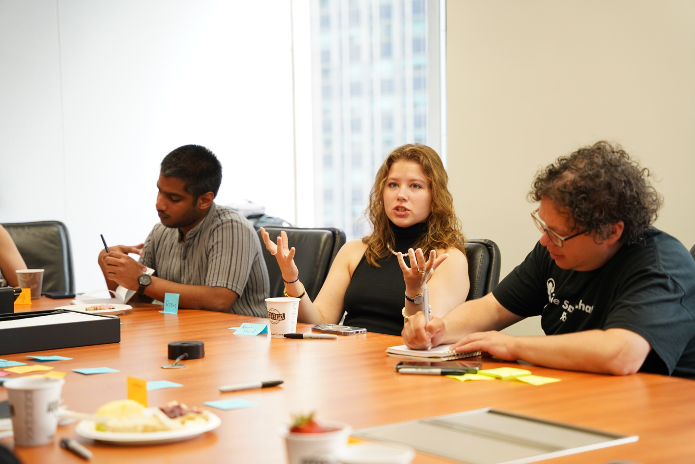
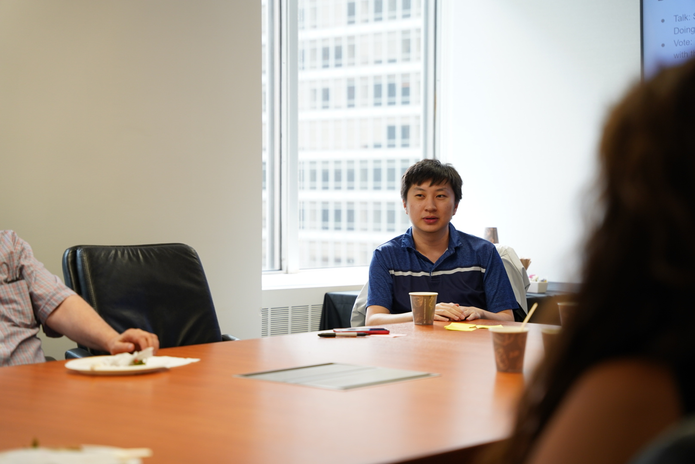
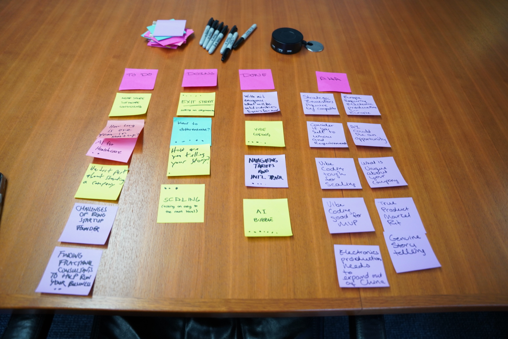
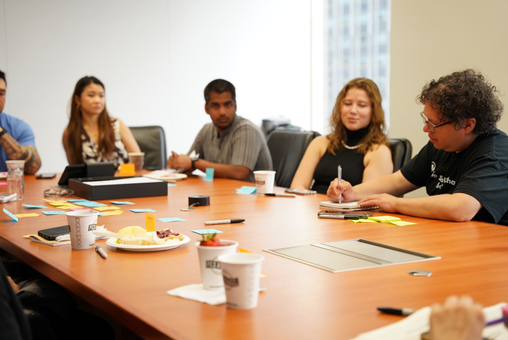
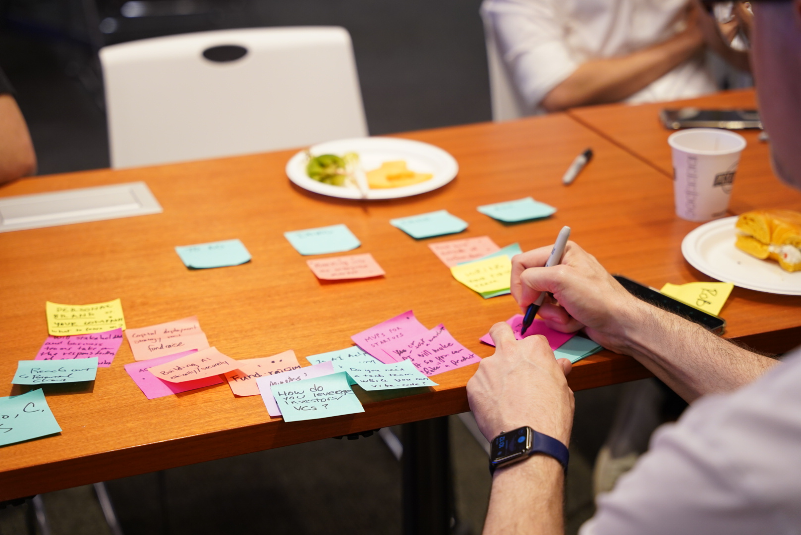
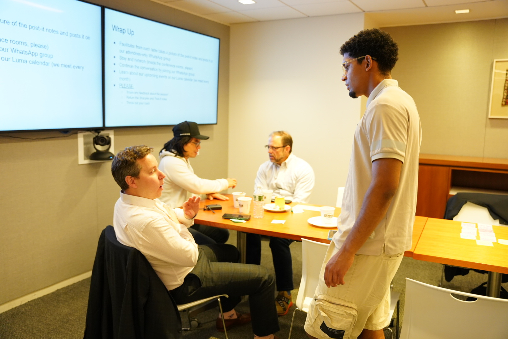

# Table site — proposed image selections (rebalanced)

> **Rebalance pass:** Benjamin was in 9 of the prior selections, Karina in 4 — too organizer-heavy for a member-focused home page. This revision shifts most home-page photos to **attendee-only** shots, keeps organizers visible only where they belong (3-organizer About photo, 2025 co-organizers paragraph). Karina retained in a few spots she's naturally in; Benjamin appears only in the two organizer-specific slots.
>
> Sources: November 2025 folder (28 files, current era) + June 2025 folder (32 files, pre-rebrand). Sampled 26 of 65 so far.

---

## HOME PAGE

### Hero — full-width attendees behind tagline overlay



**`DSC08425.JPG`** — Six diverse attendees seated around the table, daylight, tapestry on the wall, post-its and coffee cups across the foreground. No organizers visible. Mid-frame composition has depth from foreground to back wall — works with a left-aligned hero text overlay. *(Was DSC01100; that one had Benjamin in frame.)*

---

### Real rooms.


**`DSC01101.JPG`** — Wide view down the length of the table: ~10 attendees seated along the long edge, projector visible at the far end. Sharp focus, diverse mix. *(May 2026 swap from DSC01098, which had Karina at the front of the room and read soft per stakeholder feedback. DSC01101 has no organizer prominently in frame.)*

---

### Real questions.



**`DSC08383.JPG`** — Woman attendee mid-gesture as she speaks, listeners on either side. Strong "attendee mid-thought" composition; foregrounds a female speaker to help gender balance per stakeholder feedback. *(May 2026 swap from DSC08410, which featured Sean and was flagged for de-prioritization. DSC08410 stays in `incoming/` as an alternate.)*

---

### Real talk.


**`DSC08363.JPG`** — Three attendees listening intently, intimate framing, post-its and name cards on the table. Diverse group, peer-to-peer feel. *(Was DSC01117, which had Benjamin.)*

---

### Members band — 6 thumbnails

A small grid under "Who's at Table — 1,300+". Six varied shots, attendee-led.

#### Members 1


**`DSC01106.JPG`** — Three attendees, candid smiles, intimate framing. Pure attendee group, no organizers. *(Replaces DSC01118, which had Benjamin.)*

#### Members 2


**`DSC01110.JPG`** — Four attendees in conversation; candid attentive faces, post-its prominent on the table. *(Keep — no organizers in frame.)*

#### Members 3


**`DSC08398.JPG`** — Four attendees listening; mixed expressions, daylight. *(Keep.)*

#### Members 4


**`DSC08393.JPG`** — Four attendees with NYC view, warm smile in center. Karina visible (one of three Karina appearances total — natural balance). *(Keep.)*

#### Members 5


**`DSC08377.JPG`** — Woman gesturing mid-sentence to attentive listener. *(Keep — attendees only.)*

#### Members 6



**`DSC08413.JPG`** — Young attendee speaking thoughtfully, NYC window behind him, clean composition. *(Replaces DSC01103, which featured Benjamin speaking.)*

---

### Aha moments — optional section banner



**`DSC08430.JPG`** — Overhead shot of the Lean Coffee board mid-session: post-its laid out in **TO DO / DOING / DONE / AHA** columns, with stacked Sharpies at the top. Pure workshop artifact, no people. Tells the format story visually before the synthetic post-it collage below it. Recommend using this as the aha-moments section header. *(Was DSC08339, a cropped overhead with a hand. DSC08430 is more legible and storytelling.)*

---

## ABOUT PAGE

### Three-organizer photo


**`DSC01076.JPG`** — Geoff, Karina, Benjamin posed together. The single legitimate "all-three-organizers" moment on the site. Portrait EXIF — handle in CSS with `image-orientation: from-image` or re-save landscape. *(Keep.)*

---

### Origin 4a — "In 2018, Geoff Scott started something simple..."


**`DSC08322.JPG`** — Wide establishing shot with "Startup Lean Coffee README" visible on the screen. Historical authenticity for the 2018-era paragraph. *(Keep.)*

---

### Origin 4b — "No keynote speakers. No pitch decks. Just genuine, raw conversations..."



**`DSC08387.JPG`** — Five attendees around the table, post-its scattered, one taking notes in the foreground. Captures the "real conversations about real questions" feel. *(Was DSC08363, which moved to Real talk on the home page.)*

---

### Origin 4c — "The conversations have spanned fundraising, product-market fit, AI..."



**`DSC08400.JPG`** — Documentary detail: hands mid-writing on a post-it, the topics already on the table around them. Breaks up the alternating block rhythm with a no-faces shot that visually represents "the conversations have spanned [these topics]." *(Was DSC08410, which moved to Real questions on the home page.)*

---

### Origin 4d — "In 2025, Benjamin Friedman and Karina Muller joined as co-organizers..."


**`DSC01084.JPG`** — Karina and Benjamin in casual standing conversation. The right slot for both of them to appear — the paragraph names them by name. *(Keep.)*

---

### Origin 4e — "Today, Table runs regular gatherings in New York and beyond..."



**`DSC08434.JPG`** — Post-session wrap-up scene: attendees still talking, a young man standing as if just getting up to leave, "Wrap Up" slide visible on the screen behind. Captures "stick around after for more conversation" / "there's always a seat for you" energy. Diverse, no organizers visible. *(Was DSC01122, the thumbs-up group, which had Benjamin.)*

---

## SPONSORS PAGE

No images proposed for v1 — page is mostly typographic. If we want one atmospheric shot, we could reuse the hero at smaller scale. Recommendation: keep it text-and-logos.

---

## Organizer counts (after rebalance)

- **Geoff:** 1 photo — DSC01076 (3 organizers).
- **Karina:** 3 photos — DSC01076 (3 organizers), DSC08393 (Members 4 — incidentally in frame), DSC01084 (Origin 4d), and possibly DSC01098 (Real rooms — speaker at front).
- **Benjamin:** 2 photos — DSC01076 (3 organizers), DSC01084 (Origin 4d). Only the slots where his presence is contextually right.

---

## File rename plan

When approved, the 17 chosen files move into `assets/images/` with descriptive names:

```
DSC08425.JPG → hero-attendees-wide.jpg
DSC01098.JPG → real-rooms-wide.jpg
DSC08410.JPG → real-questions-speaker.jpg
DSC08363.JPG → real-talk-three-listening.jpg
DSC01106.JPG → members-01-smiles.jpg
DSC01110.JPG → members-02-conversation.jpg
DSC08398.JPG → members-03-daylight.jpg
DSC08393.JPG → members-04-nyc-window.jpg
DSC08377.JPG → members-05-gesture.jpg
DSC08413.JPG → members-06-speaking.jpg
DSC08430.JPG → aha-moments-board-overhead.jpg
DSC01076.JPG → organizers-three.jpg
DSC08322.JPG → origin-2018-lean-coffee.jpg
DSC08387.JPG → origin-discussion.jpg
DSC08400.JPG → origin-postits-writing.jpg
DSC01084.JPG → origin-coorganizers-2025.jpg
DSC08434.JPG → origin-today-wrap-up.jpg
```

`incoming/` stays gitignored; the 48 unused files don't ship.

---

## Open questions

1. **Real rooms (DSC01098)** — speaker at front is Karina. If you'd rather Real rooms have no organizers at all, easiest swap is `DSC01101` (wide table from one end, ~10 attendees) — let me confirm no Benjamin in that one first.
2. **Aha banner image** — DSC08430 (Lean Coffee board, recommended) vs DSC08339 (hand writing closeup) vs no banner. Confirm.
3. **More candidates** — sampled ~40% of the library so far. If specific shots you want considered aren't proposed, point me at the file numbers.
